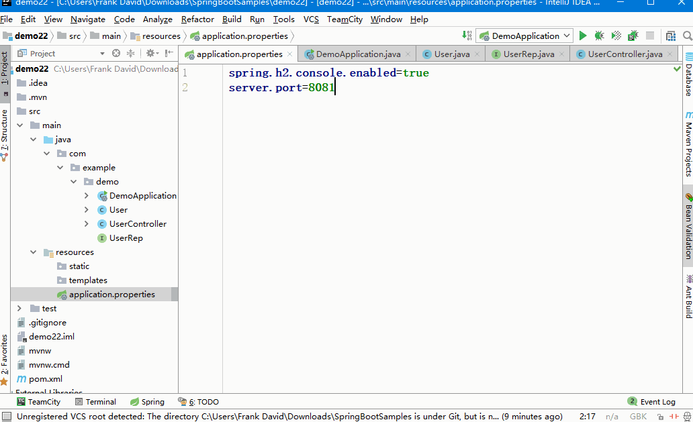

# 作业4
写4个rest接口分别实现user的增删改查
# express
```bash
# 安装必要的依赖
npm i express mysql body-parser
```
```js
const express = require("express")
const mysql = require("mysql")
const app = express()
const bodyParser = require("body-parser")
app.use(bodyParser.json());
app.use(bodyParser.urlencoded({extended: false}));
const conn = mysql.createConnection({
	host     : '127.0.0.1',  //主机
	user     : 'root',       //MySQL认证用户名
	password : '',           //MySQL认证用户密码
	port: '3306',            //端口号
	database:'test',         //数据库
});

// 查
app.get("/user/:id",function(req,res){
    const id = req.params.id;
    let sql = `select * from user where id =${id}`;
    conn.query(sql,function(err,rows){
        if(err){
            console.log(err);
        }else{
            res.json(rows);
        }
    })
});
// 增
app.post("/user",function(req,res){
    const {name,age} = req.body;
    let sql = `insert into user(name,age) values ('${name}',${age})`;
    conn.query(sql,function(err,rows){
        if(err){
            console.log(err);
        }else{
            res.json({status:'ok'});
        }
    })
});
// 删
app.delete("/user/:id",function(req,res){
    const id = req.params.id;
    let sql = `delete from user where id =${id}`;
    conn.query(sql,function(err,rows){
        if(err){
            console.log(err);
        }else{
            res.json({status:'ok'});
        }
    })
});
// 改
app.put("/user/:id",function(req,res){
    const id = req.params.id;
    const {name,age} = req.body;
    let sql = `update user set name='${name}',age=${age} where id = ${id}`;
    conn.query(sql,function(err,rows){
        if(err){
            console.log(err);
        }else{
            res.json({status:'ok'});
        }
    })
});
app.listen(8081)
```
# gin
```go
package main

import (
	"github.com/gin-gonic/gin"
	"github.com/jinzhu/gorm"
	_ "github.com/go-sql-driver/mysql"

	"strconv"
)
//*******************声明模型和表名 注意自增和主键的注解
type User struct{
	Id   int `gorm:"primary_key;AUTO_INCREMENT"`
	Name string
	Age int
}

func (User) TableName() string{
	return "user"
}

func main() {
	r := gin.Default()
	// 查
	r.GET("/user/:id", func(c *gin.Context) {
		db, _ := gorm.Open("mysql", "root:@tcp(127.0.0.1:3306)/test?charset=utf8")
		id:=c.Param("id")
		u:=User{}
		db.Where("id=?",id).Find(&u)
		if u.Id>0{
			c.JSON(200,u)
		}else{
			c.JSON(200,gin.H{})
		}
		defer db.Close()
	})
	// 增
	r.POST("/user", func(c *gin.Context) {
		db, _ := gorm.Open("mysql", "root:@tcp(127.0.0.1:3306)/test?charset=utf8")
		name:=c.PostForm("name")
		age,_:=strconv.Atoi(c.PostForm("age"))
		db.Save(User{0,name,age})
		c.JSON(200,gin.H{"status":"ok"})
		defer db.Close()
	})
	// 改
	r.PUT("/user/:id", func(c *gin.Context) {
		db, _ := gorm.Open("mysql", "root:@tcp(127.0.0.1:3306)/test?charset=utf8")
		id,_:=strconv.Atoi(c.Param("id"))
		name:=c.PostForm("name")
		age,_:=strconv.Atoi(c.PostForm("age"))
		db.Save(User{id,name,age})
		c.JSON(200,gin.H{"status":"ok"})
		defer db.Close()
	})
	// 删
	r.DELETE("/user/:id", func(c *gin.Context) {
		db, _ := gorm.Open("mysql", "root:@tcp(127.0.0.1:3306)/test?charset=utf8")
		id:=c.Param("id")
		db.Where("id=?",id).Delete(User{})
		c.JSON(200,gin.H{"status":"ok"})
		defer db.Close()
	})
	r.Run(":8081") // listen and serve on 0.0.0.0:8081
}
```
# spring-boot
真正企业用的最多的后台服务还是java支撑的，见识下spring-boot的超快速完成增删改查:

1 IDEA创建项目
  
2 补全增删改查方法   
  
3 测试  
  